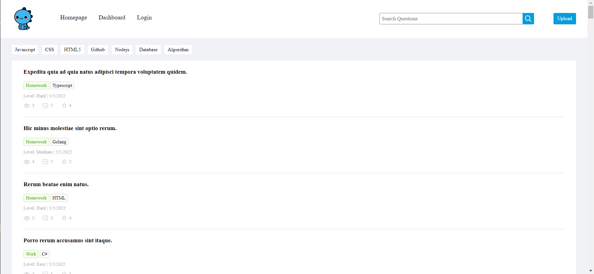

# blue-it

## Purpose
A website that allows the user to post and find answers to thier questions concerning development in a singular place. Why search when everything is here?

## Built With
* Bcrypt
* Sequelize
* Express
* Handlebars
* Mysql2
* Faker-js

## Screenshot

## Website
https://github.com/Nesnah1307/blue-it

## Contribution
* Brian Hernandez: 
* Mack Hanson: https://github.com/Nesnah1307
* Matthew Rogers: https://github.com/Vrentadax
* Neo Ji: 
